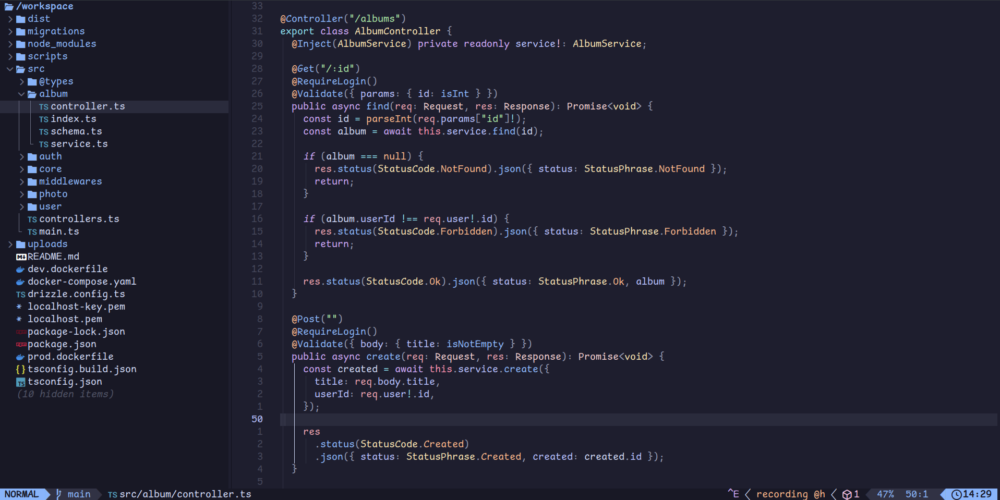

# Gallery RESTful API



此專案起初是應徵某軟體公司時，主管開出的後端測試題目，然而該職缺很快就關閉了。眼見專案已幾乎開發完成，於是心想那不如來挑戰一下自己，將專案進行全面重構，採用將成為 ECMAScript 標準的裝飾器語法，並應用各種開發觀念和設計原則，在合理範圍內確保高品質的專案 / 程式碼架構，同時也使程式碼變得更簡潔、更容易擴充、修改、維護。

題目大致上為：開發一個管理使用者相簿的後端 API 服務，題目中所有必要、加分項目皆已完成。

- 為測試自己的真實能力，100% 獨立開發，整個過程**無使用**任何 AI 工具
- 使用 docker 提供一致、可進版控、開箱即用的系統環境 ( express, postgres, redis )
- 100% TypeScript、 ES6+ 語法，並適時運用泛型，使程式更嚴謹且靈活 ( 可參考`src/core/utils.ts` )
- 啟用幾乎最嚴格的 tsconfig 規則，並搭配 eslint/prettier，確保程式碼品質與一致的格式
- 符合物件導向 SOLID 原則，並實現裝飾器、依賴注入等設計模式，使程式碼更簡潔，更容易擴充、修改、維護 ( 寫法範例可參考`src/album/controller.ts`, 裝飾器實作細節位於`src/core/decorators/` )
- RESTful 風格的 API 端點
- 使用 dpdm 檢查循環引用問題 ( circular dependency )
- 撰寫單元測試 ( `src/core/utils.spec.ts`, `src/auth/utils.spec.ts` )
- 使用 helmet 對 Response Headers 做基礎資安設定
- 使用 express-rate-limit 保護 API 端點防止 DDoS 攻擊
- 使用 Drizzle ORM，100% type safe，以接近原生 SQL 的語法操作資料庫 ( 可參考`src/album/service.ts` )
- 以 Passport.js 實作的登入註冊系統 ( 實作細節位於`src/auth/authenticator.ts` )
- 使用 Redis 作為 SessionStore
- 實現串流程式設計，不須建立暫時檔案，最大化效能
  - 實現 Buffer 與 Stream 機制 ( 可參考`src/photo/upload-parser.ts` )
  - 允許一邊壓縮相簿裡的所有相片，一邊串流回客戶端下載 ( 可參考`src/photo/download/` )
  - 允許一次上傳多張相片，批次寫入資料庫提昇效能
- 實作簡易 Logger、http-logging ( `src/core/logger.ts`, `src/middlewares/http-logging.ts` )

> 限制：可惜的是，目前 ECMAScript 標準的裝飾器支援度可說是相當不好，現階段如果想在專案中寫裝飾器，建議還是使用諸如 Nest.js 等成熟的框架 / 套件，或先暫時使用`reflect-metadata`套件，並啟用`experimentalDecorators`, `emitDecoratorMetadata`等 tsconfig 設定進行開發，待支援度變得較完善時，再修改底層實作細節即可，開發好的原始碼甚至不須任何變動即可完成改版！


## Usage

1. clone & get into the project

```bash
$ git clone https://github.com/rabbit19981023/gallery-rest-api
$ cd gallery-rest-api
```

2. generate dev SSL certificates for localhost:

```bash
# we use mkcert for simply making locally-trusted dev certificates.
$ apt-get install mkcert

# create trusted local CA
$ mkcert -install

# create certificates for localhost
$ mkcert localhost


Created a new certificate valid for the following names 📜
 - "localhost"

The certificate is at "./localhost.pem" and the key at "./localhost-key.pem" ✅
```

### [**Recommended**] Setup with Docker

Using docker to simply setup our services in just few steps:

```bash
# use default environment variables (Even no need to modify! We have setup dev postgres & redis for you!)
$ cp .env.example .env

# IMPORTANT!:
# create uploads/ before running docker services to prevent volumes permission issues
$ mkdir uploads

# build & run all docker services in background
$ docker compose up -d

# run database migrations in dev server
$ docker compose exec express-dev sh -c "npm i && npm run migration:run"
```

The API server is available at https://localhost now!

To inspect the logs of the production API server, run:

```bash
$ docker compose attach express-prod
```

To view all logs of the production API server, run:

```bash
$ docker compose logs express-prod
```

To get into express-prod container, run:

```bash
$ docker compose exec -it express-prod sh
```

To get into express-dev container, run:

```bash
$ docker compose exec -it express-dev fish
```

To shutdown all docker services, run:

```bash
$ docker compose down
```

### Setup without docker (requires Node.js v20.6.0+):

```bash
# install dependencies
$ npm i

# prepare your environment variables
$ cp .env.example .env

# run database migrations
$ npm run migration:run

# build source code
$ npm run build

# leave production-only dependencies in node_modules/
$ npm ci --omit=dev

# run server
$ node --env-file=.env dist/main.js
```

### Other useful scripts:

```bash
# build from source & run server
$ npm run start

# run dev server
$ npm run dev

# build from source
$ npm run build

# run code lint
$ npm run lint

# run type checking
$ npm run type-check

# run circular dependency checking
$ npm run circular-dep-check

# run unit tests
$ npm run test:unit
```

## API Endpoints

> NOTE: If you are
> 1. using mkcert to generate locally-trusted dev certs
> 2. using postman to test API endpoints

> Then you need to manually add CA cert file for postman:
> 1. run `$ mkcert -CAROOT` to get CA cert files location
> 2. open postman settings -> Certificates -> turn on CA Certificates and select PEM file: `<your_CAROOT>/rootCA.pem`

### Auth

Login:

```bash
POST /api/v1/auth/login
Content-Type: application/x-www-form-urlencoded

Body
email: string;
password: string;
```

Signup:

```bash
POST /api/v1/auth/signup
Content-Type: application/x-www-form-urlencoded

Body
email: string;
password: string;
role?: "user" (default) | "admin";
```

Logout:

```bash
GET /api/v1/auth/logout
```

### Albums

Find current user's all albums (login required):

```bash
GET /api/v1/albums
```

Find a current user's album (login required):

```bash
GET /api/v1/albums/:id
```

Create an album for current user (login required):

```bash
POST /api/v1/albums
Content-Type: application/x-www-form-urlencoded

Body
title: string;
```

Update a current user's album (login required):

```bash
PUT /api/v1/albums/:id
Content-Type: application/x-www-form-urlencoded

Body
title: string;
```

Delete a current user's album (login required):

```bash
DELETE /api/v1/albums/:id
```

### Photos

Find all photos in specified album (login required):

```bash
GET /api/v1/albums/:albumId/photos
```

Find a photo in specified album (login required):

```bash
GET /api/v1/albums/:albumId/photos/:id
```

Create one or multiple photos in specified album (login required):

```bash
POST /api/v1/albums/:albumId/photos
Content-Type: multipart/form-data

Body
files: File | File[];
descriptions: {
  "<filename 01>": "<description 01>",
  "<filename 02>": "<description 02>",
  ...
} satisfies JSONString; # for example: {"1.jpg": "description 1", "2.jpg": "description 2"}
```

Update a photo in specified album (login required):

```bash
PUT /api/v1/albums/:albumId/photos/:id
Content-Type: multipart/form-data

Body
file?: File;
description?: string;
```

Delete a photo in specified album (login required):

```bash
DELETE /api/v1/albums/:albumId/photos/:id
```

### Download Photo(s)

Download all photos in specified album (login required):

```bash
GET /api/v1/download/albums/:albumId/photos
```

Download one photo in specified album (login required):

```bash
GET /api/v1/download/albums/:albumId/photos/:id
```
